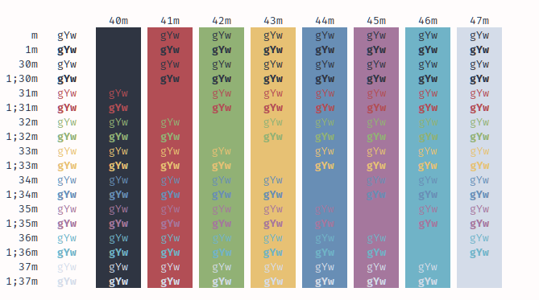
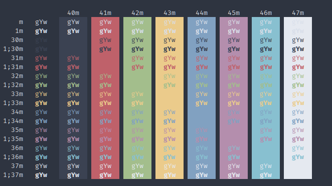

# terminal-color-scheme

This project is an initial attempt in creating a unified terminal/code font and color scheme. 

The following colors were created based off of the Nordic color scheme.

| code 	| color   	| dark   	| light  	|
|------	|---------	|--------	|--------	|
| bg   	|         	| 2e3440 	| fffcfc 	|
| 0    	| black   	| 3b4252 	| 2f3542 	|
| 1    	| red     	| bf616a 	| b24e55 	|
| 2    	| green   	| a3be8c 	| 91b175 	|
| 3    	| yellow  	| ebcb8b 	| e7c174 	|
| 4    	| blue    	| 81a1c1 	| 688eb5 	|
| 5    	| magenta 	| b48ead 	| a5779d 	|
| 6    	| cyan    	| 88c0d0 	| 70b3c7 	|
| 7    	| white   	| e5e9f0 	| e0e5ed 	|

Some config files have been created and may be manually inserted into the respective application config files:

- Terminator Themes (Color and Font)
- Sublime Text Preferences (Font)

## Sample Colors

## References/Inspiration:
- Nordic theme